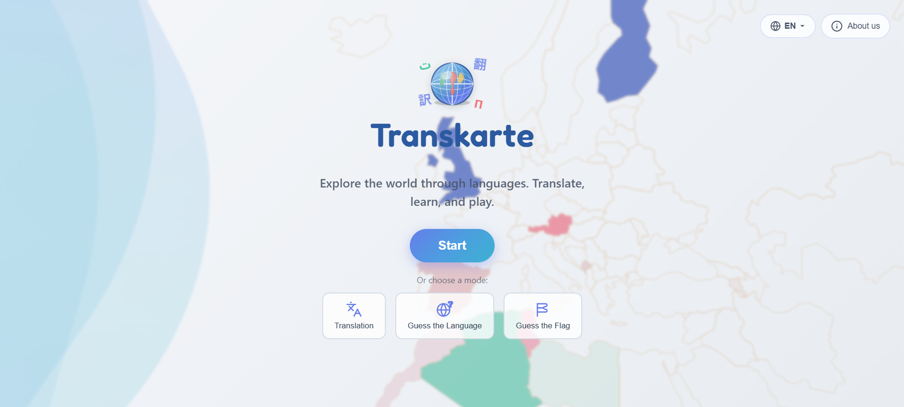
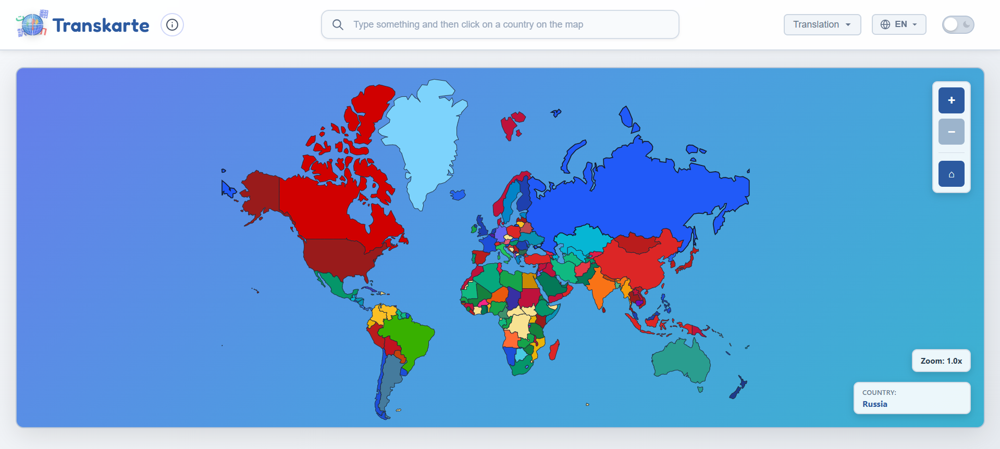
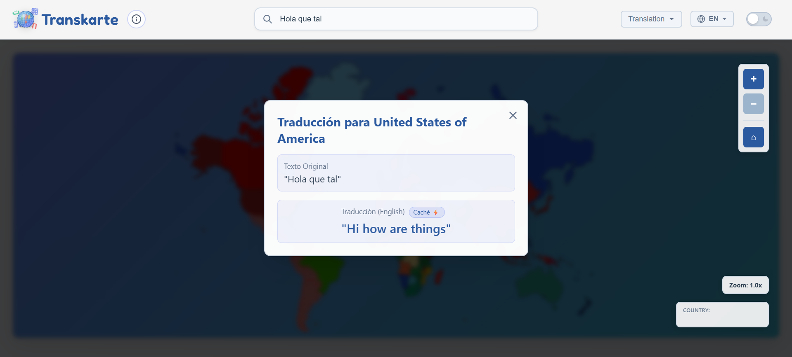
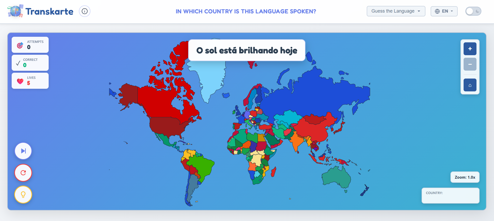
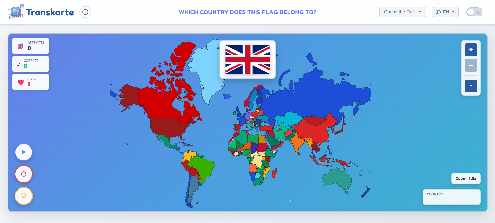

<div align="center">

<a id="inicio"></a>


### *Explore the world while learning languages*

**Educational web application that combines geography and interactive translation**

<!-- BADGES DE ESTADO -->


[](https://sdurutr436.github.io/ProyectoIntermodular-MapaInteractivo/)

</div>

---

## 📖 About the Project

**Transkarte** is an educational web application that transforms language learning into an interactive and visual experience. Through an interactive world map, users can:

- 🗺️ **Explore** countries with interactive visualization and visual effects
- 🔤 **Translate** words and phrases to the official language of each country
- 🎮 **Play** educational modes to learn geography and languages
- 🌍 **Discover** over 150 countries and their official languages

The application combines **React**, **TypeScript**, **Node.js**, and **MongoDB** to offer a smooth and educational experience. Developed with Docker for easy deployment and without requiring user registration, Transkarte puts privacy and simplicity first.

## 📋 Table of Contents

- [🛠️ Tech Stack](#️-tech-stack)
- [🚀 Production Demo](#-production-demo)
- [📸 Screenshots](#-screenshots)
- [💻 Installation and Local Development](#-installation-and-local-development)
- [👥 Development Team](#-development-team)
- [📚 Documentation](#-documentation)
- [📊 Project Status](#-project-status)
- [🔌 Backend API](#-backend-api)
- [📄 License](#-license)

---

## 📊 Project Status

### ✅ Completed Project

**Backend:**
- [x] MongoDB configured in Docker
- [x] Data models (Translation, GameStats)
- [x] Translation system with DeepL + Google Translate fallback
- [x] Automatic language detection
- [x] Translation cache system
- [x] Game API (phrases and flags)
- [x] Mappings of 150+ countries and languages

**Frontend:**
- [x] React 18 + TypeScript + Vite
- [x] Interactive world map (react-simple-maps)
- [x] Translation Mode: translate to the language of the clicked country
- [x] Guess the Language Mode: recognize phrases in different languages
- [x] Guess the Flag Mode: identify countries by their flag
- [x] Lives and real-time statistics system
- [x] Internationalization (Spanish/English)
- [x] Dark/light mode
- [x] Interactive landing page
- [x] Responsive design
- [x] State management with Zustand (centralized store with persistence)
- [x] HTTP API with Axios (interceptors, error handling, timeouts)

**Infrastructure:**
- [x] Complete Dockerization (frontend + backend + MongoDB)
- [x] Configured environment variables
- [x] CORS and basic security
- [x] Seeding script for initial translation data

---

## 🛠️ Tech Stack

<div align="center">

### Frontend


### Backend & Database


### DevOps & Tools


</div>

### Frontend Detalles
- **react-simple-maps** - Visualización de mapas SVG interactivos
- **Axios** - Cliente HTTP con interceptores y manejo centralizado de errores

### APIs Externas
- **🔷 DeepL API** - Traducción de alta calidad (principal)
- **🌐 Google Translate API** - Traducción gratuita (fallback)

---

## 🚀 Production Demo

**Production URL:** [https://transkarte.up.railway.app/](https://transkarte.up.railway.app/)

---

## 📸 Screenshots and User Guide

### 🏠 Landing Page

<div align="center">
  
</div>

**What can the user do here?**

- 🌍 **View animated presentation** of the project with visual effects
- 🎯 **Choose mode**: Translation or Game (2 modes)
- 🌐 **Change interface language**: Spanish ↔️ English (button top right)
- 📖 **Read description** of each mode before starting and information about us
- 🚀 **Start experience** by clicking on any mode card

---

### 🗺️ Interactive Map (Main View)

<div align="center">
  
</div>

<div align="center">
  
</div>

**What can the user do here?**

- 🖱️ **Hover over countries**: See visual highlight effect
- 🔍 **Use search bar**: To know how to say a phrase or word in a country when the user clicks on it
- ✍️ **Write text**: Enter word or phrase (maximum 500 characters)
- 🚫 **See automatic blocking**: Countries that speak the language of the text appear in red
- 🌍 **Select destination country**: Click on any country on the map
- 🎨 **Navigate the map**: Scroll to zoom, drag to move
- 🔄 **See instant translation**: Result in modal with animation
- 💾 **Automatic cache**: Repeated translations are instant (saved in DB)
- ❌ **Close modal**: Click outside the modal or close button
- 🏠 **Return to landing page**: "i" button in top left corner next to the logo to return to the main page
- 🌐 **Change language**: ES/EN selector in top bar
- 🌓 **Change theme**: Sun/moon icon in top bar

**Usage example:**
1. Type "Hello world" in the text field
2. English-speaking countries (USA, UK, Australia) are automatically blocked in red
3. Click on Spain → "Hola mundo" appears
4. Click on France → "Bonjour le monde" appears

---

### 🎮 Game Mode: Guess the Language

<div align="center">
  
</div>

**What can the user do here?**

- 📖 **Read phrase in unknown language**: Appears at the top
- 🤔 **Guess the correct country**: Click on the country that speaks that language
- ❤️ **Manage lives**: You have 5 lives (hearts), lose 1 per error
- 📊 **See real-time statistics**: Hits, misses, and points.
- ✅ **Receive immediate feedback**: Green animation if correct, red if wrong
- 🔄 **New automatic question**: After each answer (correct or incorrect)
- 💀 **Game Over**: When losing all 5 lives, see statistics summary
- ➡️ **Skip attempt**: Button to skip the phrase to a new one, at the cost of one attempt
- 🔁 **Retry**: Button to start new game
- 🏠 **Return to menu**: Abandon game at any time

**Game mechanics:**
- Each correct answer adds +1 point
- Each error subtracts 1 life
- Random phrases in 50+ different languages
- Some languages have multiple valid countries (e.g., Spanish → Spain, Mexico, Argentina...)

---

### 🏴 Game Mode: Guess the Flag

<div align="center">
  
</div>

**What can the user do here?**

- 🏴 **See random flag**: Appears large at the top
- 🗺️ **Guess the country**: Click on the correct country on the map
- ❤️ **Manage lives**: You have 5 lives, lose 1 per error
- 📊 **See statistics**: Hits, misses, points, success percentage at the end of the game
- ✅ **Visual feedback**: Green/red animation + correct country name
- 🌍 **Learn geography**: 195 flags of countries around the world
- 🔄 **New automatic flag**: After each attempt
- 💀 **Game Over**: See complete summary when losing all lives
- ➡️ **Skip attempt**: Button to skip to a new flag, at the cost of one attempt
- 🔁 **Play again**: Restart game with new random flags

**Game mechanics:**
- Each hit adds +1 point
- Each miss subtracts 1 life
- Randomly generated flags
- Includes countries from all continents
- Varied difficulty: from iconic flags to the most challenging

---

### 🎨 Common Features in All Screens

**Global Controls:**
- 🌐 **Language selector** (ES/EN) - Top right corner
- 🌓 **Dark/light theme toggle** - Sun/moon icon
- 🏠 **"i" button** - Return to landing page

**Accessibility:**
- 🎨 High contrast in dark mode
- 📢 Readable texts (minimum size 14px)
- 🖱️ Large click areas (minimum 44x44px)
- 🔊 Clear visual states (hover, focus, active)

---

## 💻 Installation and Local Development

### Prerequisites

#### ⭐ Option 1: With Docker (Recommended)

- ✅ **Docker Desktop** installed and running
- ✅ **Git**
- ❌ **You DON'T need** Node.js installed
- ❌ **You DON'T need** MongoDB installed
- ❌ **You DON'T need** to run `npm install` manually

#### 📦 Option 2: Without Docker (Manual)

- ✅ **Node.js** 20+
- ✅ **MongoDB** Community Edition
- ✅ **Git**

---

### 🐳 Installation with Docker (Recommended)

1️⃣ **Clone the repository**

```bash
git clone https://github.com/sdurutr436/ProyectoIntermodular-MapaInteractivo.git
cd ProyectoIntermodular-MapaInteractivo
```

2️⃣ **Start all services**

```bash
docker-compose up -d --build
```

> 🎉 **Done!** Dependencies are automatically installed inside the containers.

3️⃣ **Access the application**

- **Frontend**: [http://localhost:3000](http://localhost:3000)
- **Backend API**: [http://localhost:5000](http://localhost:5000)
- **Health Check**: [http://localhost:5000/health](http://localhost:5000/health)
- **MongoDB**: `localhost:27017`

4️⃣ **View logs (optional)**

```bash
# Logs of all services
docker-compose logs -f

# Server logs only
docker-compose logs -f server

# Client logs only
docker-compose logs -f client
```

5️⃣ **Stop services**

```bash
docker-compose down
```

---

### 📦 Manual Installation (Without Docker)

<details>
<summary><b>Click here for instructions without Docker</b></summary>

1️⃣ **Clone the repository**

```bash
git clone https://github.com/sdurutr436/ProyectoIntermodular-MapaInteractivo.git
cd ProyectoIntermodular-MapaInteractivo
```

2️⃣ **Install dependencies**

```bash
# Backend
cd server
npm install

# Frontend
cd ../client
npm install
cd ..
```

3️⃣ **Configure MongoDB**

- Install [MongoDB Community Edition](https://www.mongodb.com/try/download/community)
- Start the service: `mongod`
- Update `MONGO_URI` in `server/.env`:
  ```
  MONGO_URI=mongodb://localhost:27017/translator_db
  ```

4️⃣ **Start services**

```bash
# Terminal 1 - Backend
cd server
npm run dev

# Terminal 2 - Frontend
cd client
npm run dev
```

5️⃣ **Access the application**

- **Frontend**: [http://localhost:5173](http://localhost:5173)
- **Backend**: [http://localhost:5000](http://localhost:5000)

</details>

---

## 👥 Development Team

<div align="center">

| Avatar | Name | Role | GitHub |
|:------:|--------|-----|:------:|
|  | **Sergio Durán Utrera** | Full Stack Developer | [](https://github.com/sdurutr436) |
|  | **Manolo Cárdeno Sánchez** | Full Stack Developer | [](https://github.com/manolo-card) |
|  | **Francisco J. Redondo González** | Full Stack Developer | [](https://github.com/FranRG96) |

</div>

> 💡 This project was developed as part of the **Intermodular Project** of the **Web Application Development (DAW)** cycle.

---

## 📚 Documentation

### 📖 API Documentation

The complete code documentation (Backend + Frontend) is available online in one place, automatically generated with TypeDoc:

- **🌐 Unified Documentation**: [https://sdurutr436.github.io/ProyectoIntermodular-MapaInteractivo/](https://sdurutr436.github.io/ProyectoIntermodular-MapaInteractivo/)

The documentation includes:
- ⚙️ **Backend**: REST API, models, translation services, game routes
- 🎨 **Frontend**: React components, services, contexts, TypeScript types

Everything integrated in a single interface with sidebar menu for easy navigation between modules.

Documentation is automatically generated on each push to `main` using GitHub Actions.

### 📂 Project Documentation

All technical and planning documentation is in the [`/docs`](./docs) folder:

- 📄 [**Problem and Justification**](./docs/problema.md) - Context and project need
- 🎯 [**Objectives and Scope**](./docs/objetivos-alcance.md) - Goals and project limits
- 🔧 [**Technical Feasibility**](./docs/viabilidad-tecnica.md) - Technical analysis and feasibility
- 💰 [**Required Resources**](./docs/recursos.md) - Human and technical resources
- ⚖️ [**Legislation and Compliance**](./docs/legislacion.md) - GDPR, accessibility and regulations

### 📖 Project Wiki

> 📚 **Complete wiki:** [https://github.com/sdurutr436/ProyectoIntermodular-MapaInteractivo/wiki](https://github.com/sdurutr436/ProyectoIntermodular-MapaInteractivo/wiki)

Pages available in the wiki:
- [Home](https://github.com/sdurutr436/ProyectoIntermodular-MapaInteractivo/wiki) — Cover and general presentation of the project
- [Meeting Minutes](https://github.com/sdurutr436/ProyectoIntermodular-MapaInteractivo/wiki/Actas-de-reuniones) — Summaries and agreements from team meetings
- [Resource and Time Management](https://github.com/sdurutr436/ProyectoIntermodular-MapaInteractivo/wiki/Gesti%C3%B3n-de-Recursos-y-Tiempos) — Resource planning, schedule and task allocation
- [SCRUM Methodology](https://github.com/sdurutr436/ProyectoIntermodular-MapaInteractivo/wiki/Metodolog%C3%ADa-SCRUM) — Explanation of the agile framework used
- [Sprint Planning](https://github.com/sdurutr436/ProyectoIntermodular-MapaInteractivo/wiki/Planificaci%C3%B3n-de-Sprints) — Detail of sprints, objectives and deliverables
- [Team Roles](https://github.com/sdurutr436/ProyectoIntermodular-MapaInteractivo/wiki/Roles-de-equipo) — Description of roles and responsibilities of each member

---

## 📄 License

This project is part of an **academic work** developed for the **Intermodular Project** of the **Web Application Development (DAW)** cycle at **IES Rafael Alberti** (Cádiz, Spain).

### Educational Use

- ✅ **Allowed**: Use for educational and learning purposes
- ✅ **Allowed**: Cloning and modification for academic projects
- ⚠️ **Attribution required**: If you use this code, mention the original authors

### Authors

- Sergio Durán Utrera ([@sdurutr436](https://github.com/sdurutr436))
- Manolo Cárdeno Sánchez ([@manolo-card](https://github.com/nolocardeno))
- Francisco J. Redondo González ([@FranRG96](https://github.com/Fjrg0309))

---


<p align="center">
  <a href="#inicio">⬆️ Back to top</a>
</p>
