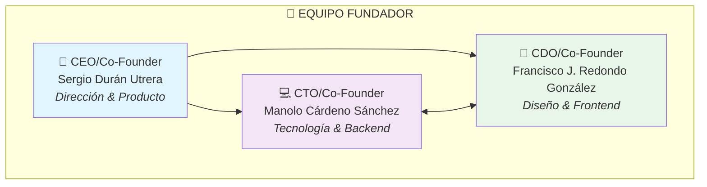
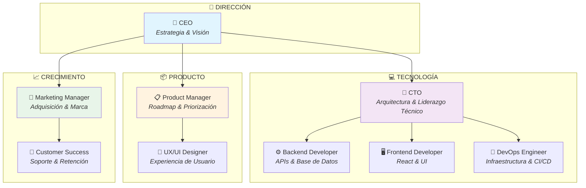
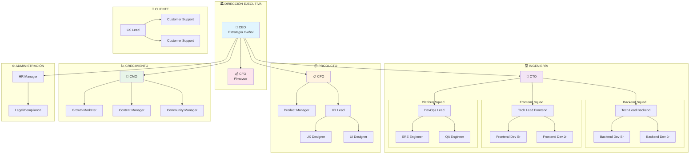

# 🏢 Estructura Organizativa - Transkarte

> **Versión:** 1.0  
> **Fecha:** Diciembre 2025  
> **Tipo de empresa:** Startup Tecnológica EdTech

---

## 📋 Índice

1. [Introducción](#-introducción)
2. [Tipo de empresa](#️-tipo-de-empresa)
3. [Estructura organizativa adoptada](#️-estructura-organizativa-adoptada)
4. [Organigrama](#-organigrama)
5. [Descripción de departamentos y funciones](#-descripción-de-departamentos-y-funciones)
6. [Justificación de la estructura](#-justificación-de-la-estructura)
7. [Plan de escalabilidad](#-plan-de-escalabilidad)
8. [Conclusiones](#-conclusiones)

---

## 🎯 Introducción

Este documento define la estructura organizativa que adoptaría el proyecto **Transkarte** si se convirtiera en una empresa real. Se detalla el tipo de empresa, los departamentos necesarios, las funciones de cada rol y cómo escalaría la organización con el tiempo.

**Transkarte** es una aplicación interactiva que permite explorar el mundo a través de los idiomas, combinando geografía con aprendizaje lingüístico de manera visual y divertida. Ofrece tres modos:
- 🌍 **Modo Traducción:** Traduce palabras/frases al idioma oficial de cualquier país del mapa
- 🎯 **Modo Adivinar Idioma:** Minijuego para identificar países por frases en su idioma
- 🚩 **Modo Adivinar Bandera:** Minijuego para localizar países por su bandera

---

## 🏷️ Tipo de Empresa

### Clasificación

| Aspecto | Descripción |
|---------|-------------|
| **Tipo** | Startup Tecnológica |
| **Sector** | EdTech (Tecnología Educativa) |
| **Modelo de negocio** | SaaS (Software as a Service) - Freemium |
| **Forma jurídica recomendada** | Sociedad Limitada (S.L.) en fase inicial |
| **Sede inicial** | España (remoto-first) |

### Características de la empresa

- **Startup tecnológica:** Empresa de nueva creación con alto potencial de crecimiento y escalabilidad.
- **SaaS/Freemium:** Software como servicio con modelo de ingresos basado en anuncios que no rompen la experiencia de usuario (tipo banner).
- **EdTech:** Enfocada en tecnología para la educación y el aprendizaje de idiomas.
- **Remote-first:** Estructura preparada para trabajo remoto desde el inicio.
- **Ágil:** Metodologías ágiles (Scrum) para desarrollo iterativo.

### Propuesta de valor empresarial

> "Democratizar el aprendizaje de idiomas y geografía a través de la visualización geográfica interactiva y minijuegos educativos, haciendo que cualquier persona pueda explorar las traducciones del mundo de forma visual, intuitiva y divertida."

---

## 🏗️ Estructura Organizativa Adoptada

### Tipo de estructura: **Horizontal / Plana con equipos ágiles**

Hemos elegido una **estructura organizativa horizontal** (también conocida como plana) por las siguientes razones:

1. **Startup en fase inicial:** Equipos pequeños requieren flexibilidad y comunicación directa.
2. **Metodologías ágiles:** Scrum/Kanban funcionan mejor con estructuras horizontales.
3. **Innovación:** Las estructuras planas fomentan la creatividad y la toma de decisiones rápida.
4. **Cultura startup:** Promueve ownership y responsabilidad compartida.

### Características de nuestra estructura

| Característica | Implementación |
|----------------|----------------|
| **Niveles jerárquicos** | 2-3 niveles máximo |
| **Comunicación** | Directa y bidireccional |
| **Toma de decisiones** | Distribuida en equipos |
| **Especialización** | Por funcionalidad/squad |
| **Flexibilidad** | Alta, roles pueden solaparse |

---

## 📊 Organigrama

### Fase Inicial (MVP - Equipo Fundador)
**3-5 personas**

### Fase de Crecimiento (Año 1-2)
**8-12 personas**

### Fase de Expansión (Año 3+)
**20-30 personas**

---

## 👥 Descripción de Departamentos y Funciones

### 1. 🎯 Dirección / Gerencia

| Rol | Responsabilidades | Competencias requeridas |
|-----|-------------------|------------------------|
| **CEO (Chief Executive Officer)** | • Definir visión y estrategia de la empresa • Representar la empresa ante inversores y stakeholders • Toma de decisiones estratégicas • Cultura y valores de la empresa • Gestión del equipo directivo | Liderazgo, visión estratégica, comunicación, networking, conocimiento del sector EdTech |
| **CFO (Chief Financial Officer)** | • Gestión financiera y presupuestaria • Planificación de inversiones • Relación con inversores • Control de gastos y rentabilidad • Reporting financiero | Finanzas, contabilidad, análisis financiero, experiencia en startups |

**Fase inicial:** El CEO asume también funciones de CFO con apoyo de gestoría externa.

---

### 2. 💻 Departamento de Desarrollo / Tecnología

| Rol | Responsabilidades | Competencias requeridas |
|-----|-------------------|------------------------|
| **CTO (Chief Technology Officer)** | • Definir arquitectura técnica • Liderar el equipo de desarrollo • Toma de decisiones tecnológicas • Gestión de deuda técnica • Evaluar nuevas tecnologías • Garantizar escalabilidad y seguridad | Arquitectura de software, liderazgo técnico, Node.js, React, MongoDB, DevOps, Cloud |
| **Backend Developer** | • Desarrollo de APIs REST • Integración con bases de datos MongoDB • Integración con APIs de traducción externas • Optimización de rendimiento • Testing backend | Node.js, Express, MongoDB, Mongoose, APIs REST, Testing |
| **Frontend Developer** | • Desarrollo de interfaces de usuario • Implementación del mapa interactivo • Integración con APIs • Responsive design • Testing frontend | React, TypeScript, Vite, react-simple-maps, CSS, Testing |
| **DevOps Engineer** | • Gestión de infraestructura • Pipelines CI/CD • Containerización (Docker) • Monitorización y alertas • Despliegues y releases | Docker, Docker Compose, CI/CD, Cloud (AWS/GCP/Azure), Linux, Kubernetes |
| **QA Engineer** | • Diseño de estrategia de testing • Pruebas funcionales y de regresión • Automatización de tests • Control de calidad • Documentación de bugs | Testing manual y automatizado, Cypress/Playwright, metodologías QA |

**En fase inicial:**
- CTO (Manolo Cárdeno): Backend + DevOps
- CDO (Francisco J. Redondo): Frontend + QA

---

### 3. 📦 Departamento de Producto

| Rol | Responsabilidades | Competencias requeridas |
|-----|-------------------|------------------------|
| **CPO/Product Manager** | • Definir roadmap del producto • Priorizar funcionalidades (backlog) • Análisis de mercado y competencia • Definir métricas de éxito (KPIs) • Coordinar con desarrollo y diseño • Gestionar feedback de usuarios | Gestión de producto, metodologías ágiles, análisis de datos, UX, conocimiento técnico básico |
| **UX Designer** | • Investigación de usuarios • Diseño de flujos de usuario • Wireframes y prototipos • Tests de usabilidad • Arquitectura de información | UX Research, Figma, prototyping, tests de usabilidad, accesibilidad |
| **UI Designer** | • Diseño visual de interfaces • Sistema de diseño • Iconografía y assets • Guía de estilos • Animaciones y microinteracciones | Figma, diseño visual, tipografía, color theory, sistemas de diseño |

**En fase inicial:**
- CEO (Sergio Durán): Product Manager
- CDO (Francisco J. Redondo): UX/UI Design

---

### 4. 📈 Departamento de Marketing y Ventas

| Rol | Responsabilidades | Competencias requeridas |
|-----|-------------------|------------------------|
| **CMO/Marketing Manager** | • Estrategia de marketing global • Posicionamiento de marca • Campañas de adquisición • Análisis de métricas de marketing • Gestión de presupuesto marketing | Marketing digital, growth hacking, SEO/SEM, analytics, branding |
| **Growth Marketer** | • Experimentos de crecimiento • Optimización de conversión (CRO) • Email marketing y automation • Análisis de funnels • A/B testing | Growth hacking, analytics, email marketing, experimentación |
| **Content Manager** | • Estrategia de contenidos • SEO y posicionamiento orgánico • Blog y recursos educativos • Copywriting • Calendario editorial | SEO, copywriting, marketing de contenidos, WordPress |
| **Community Manager** | • Gestión de redes sociales • Interacción con la comunidad • Creación de contenido social • Gestión de crisis • Partnerships con influencers | Redes sociales, comunicación, creatividad, análisis social |

**En fase inicial:** Funciones asumidas por fundadores + freelancers puntuales.

---

### 5. 💬 Departamento de Atención al Cliente

| Rol | Responsabilidades | Competencias requeridas |
|-----|-------------------|------------------------|
| **Customer Success Lead** | • Estrategia de soporte y retención • Gestión del equipo de soporte • Análisis de satisfacción (NPS/CSAT) • Onboarding de usuarios • Reducción de churn | Customer success, liderazgo, analytics, comunicación |
| **Customer Support** | • Respuesta a tickets y consultas • Resolución de problemas técnicos • Documentación de FAQs • Feedback a producto • Gestión de comunidad de usuarios | Comunicación, empatía, conocimiento del producto, resolución de problemas |

**En fase inicial:** Soporte mediante canal de Discord/email gestionado por fundadores.

---

### 6. ⚙️ Departamento de Administración

| Rol | Responsabilidades | Competencias requeridas |
|-----|-------------------|------------------------|
| **HR Manager** | • Procesos de selección • Onboarding de empleados • Cultura y employer branding • Gestión de nóminas y beneficios • Desarrollo profesional | RRHH, selección de talento, gestión de personas, derecho laboral |
| **Legal / Compliance** | • Aspectos legales y contratos • GDPR y protección de datos • Propiedad intelectual • Términos de servicio • Compliance regulatorio | Derecho tecnológico, GDPR, propiedad intelectual |

**En fase inicial:** Servicios externalizados (gestoría + abogado freelance).

---

## 📐 Justificación de la Estructura

### ¿Por qué estructura horizontal?

| Razón | Explicación |
|-------|-------------|
| **Agilidad** | Permite tomar decisiones rápidas sin burocracia |
| **Comunicación** | Flujo de información directo entre todos los miembros |
| **Innovación** | Fomenta que cualquiera pueda proponer ideas |
| **Motivación** | Mayor ownership y responsabilidad del equipo |
| **Costes** | Menos capas de management = menos costes fijos |
| **Startup stage** | Apropiada para empresas de 3-30 personas |

### ¿Por qué no otras estructuras?

| Estructura | Por qué NO la elegimos |
|------------|----------------------|
| **Jerárquica tradicional** | Demasiado rígida para una startup, frena la innovación |
| **Matricial** | Compleja para equipos pequeños, genera confusión de reporting |
| **Divisional** | Solo necesaria con múltiples productos/mercados |
| **Por proyectos** | No tenemos múltiples proyectos independientes |

### Tamaño del equipo inicial

Para el **MVP y primeros 6 meses** necesitamos:

| Fase | Personas | Roles |
|------|----------|-------|
| **MVP (actual)** | 3 | CEO/PM, CTO/Backend, CDO/Frontend |
| **Lanzamiento** | 5 | +1 Full-stack Dev, +1 Marketing/Growth |
| **Año 1** | 8-10 | +DevOps, +CS, +UX, +Content |
| **Año 2** | 15-20 | Expansión de squads técnicos y comerciales |

---

## 📈 Plan de Escalabilidad

### Fase 1: MVP y Validación (0-6 meses)
**Equipo: 3-5 personas**

| Rol         | Nombre     | Función principal           |
|-------------|------------|----------------------------|
| CEO/PM      | Sergio     | Estrategia, producto       |
| CTO/Backend | Manolo     | Backend, arquitectura      |
| CDO/Frontend| Francisco  | Frontend, diseño, UX       |
| Freelancers | -          | Diseño, marketing (puntual)|

**Objetivos:**
- Lanzar MVP funcional
- Validar product-market fit
- Conseguir primeros 1,000 usuarios
- Obtener feedback cualitativo

### Fase 2: Crecimiento inicial (6-18 meses)
**Equipo: 8-12 personas**

| CEO |
|:---:|

| **TECH (4)** | **PRODUCTO (2)** | **GROWTH (2)** |
|--------------|------------------|----------------|
| CTO          | Product Manager  | Marketing Manager |
| Backend Dev  | UX/UI Designer   | Customer Success   |
| Frontend Dev |                  |                  |
| DevOps       |                  |                  |

**Objetivos:**
- Escalar a 10,000+ usuarios
- Lanzar modelo con anuncios básicos (tipo banner)
- Optimizar métricas de retención
- Primeros ingresos recurrentes

### Fase 3: Expansión (18-36 meses)
**Equipo: 20-30 personas**

| CEO + CFO |
|:---------:|

| **TECH (10-12)** | **PRODUCTO (5)** | **GROWTH (6)** | **ADMIN (3)** |
|------------------|------------------|----------------|---------------|
| CTO              | CPO              | CMO            | HR Manager    |
| Backend Squad    | Product Managers | Growth Team    | Legal         |
| - Tech Lead      | UX Team          | Content Team   | Finance       |
| - 2-3 Devs       | - UX Lead        | Community      |               |
| Frontend Squad   | - 2 Designers    |                |               |
| - Tech Lead      |                  | Customer Success|               |
| - 2-3 Devs       |                  | - CS Lead      |               |
| Platform Squad   |                  | - 2-3 Support  |               |
| - DevOps Lead    |                  |                |               |
| - SRE            |                  |                |               |
| - QA             |                  |                |               |

**Objetivos:**
- 100,000+ usuarios activos
- Expansión B2B (instituciones educativas)
- Internacionalización
- Series A / Break-even

### Factores de escalado

| Trigger | Acción de escalado |
|---------|-------------------|
| +10,000 usuarios | Contratar Customer Support |
| Lanzamiento con anuncios sencillos | Contratar Growth Marketer |
| Problemas de escalabilidad | Contratar DevOps/SRE |
| Expansión B2B | Contratar Sales + CS dedicado |
| >15 empleados | Contratar HR Manager |
| Internacionalización | Contratar Content Manager multiidioma |

---

## 📝 Conclusiones

### Resumen de la estructura propuesta

1. **Tipo de empresa:** Startup tecnológica EdTech con modelo SaaS Freemium.

2. **Estructura organizativa:** Horizontal/plana con equipos ágiles, adecuada para la fase actual y escalable hacia el futuro.

3. **Equipo inicial:** 3 co-fundadores con roles complementarios:
   - **Sergio Durán (CEO/PM):** Estrategia, producto y visión
   - **Manolo Cárdeno (CTO):** Tecnología, backend y arquitectura
   - **Francisco J. Redondo (CDO):** Frontend, diseño y UX

4. **Escalabilidad:** Plan definido para crecer de 3 a 30 personas en 3 años, añadiendo roles según métricas de crecimiento.

5. **Departamentos clave:**
   - Tecnología (desarrollo del producto)
   - Producto (definición y diseño)
   - Growth (adquisición y retención)
   - Customer Success (soporte y satisfacción)

### Fortalezas de nuestra estructura

| Fortaleza | Beneficio |
|-----------|-----------|
| ✅ **Equipo técnico sólido** | 100% del equipo fundador es técnico, permite iterar rápido |
| ✅ **Roles complementarios** | Backend, Frontend y Producto cubiertos desde el inicio |
| ✅ **Estructura flexible** | Puede adaptarse según las necesidades del mercado |
| ✅ **Bajo overhead** | Costes de estructura mínimos en fase inicial |
| ✅ **Remote-first** | Acceso a talento global y reducción de costes |

### Próximos pasos organizativos

1. **Inmediato:** Formalizar roles y responsabilidades del equipo fundador
2. **MVP:** Evaluar necesidad de freelancers para diseño/marketing
3. **Post-lanzamiento:** Primera contratación según métricas (probablemente Customer Success)
4. **Crecimiento:** Definir proceso de hiring y cultura de empresa

---

## 📚 Referencias

- Laloux, F. (2014). *Reinventing Organizations*
- Ries, E. (2011). *The Lean Startup*
- Sutherland, J. (2014). *Scrum: The Art of Doing Twice the Work in Half the Time*
- Horowitz, B. (2014). *The Hard Thing About Hard Things*

---

*Documento elaborado para el proyecto Transkarte - Fase 1: Estructura Organizativa*
