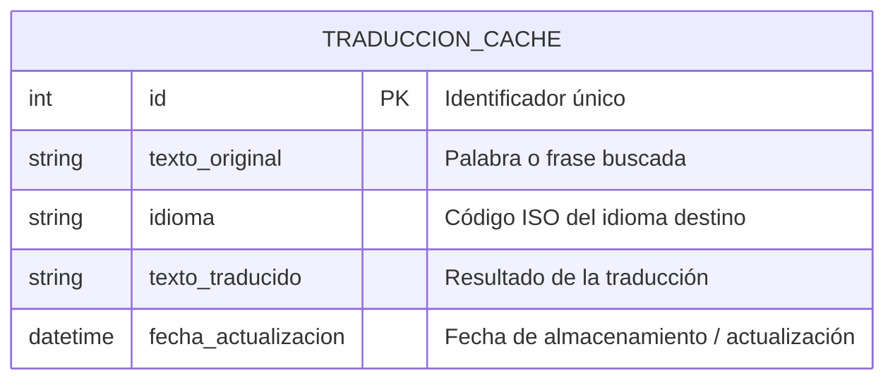

# Functional Requirements

## 1. Search Management
- **FR1:** The system must allow the user to enter a word or phrase in a search engine.  
- **FR2:** The system must store each search in the database to avoid repeated queries to the API.  
- **FR3:** The system must validate that the input is not empty before performing the search.  

## 2. Translation and Caching
- **FR4:** The system must verify if the word or phrase already exists in the database for each map language.  
- **FR5:** If the translation exists, the system must return it from the database.  
- **FR6:** If the translation does not exist, the system must request it from the translation API, store it in the database and then display it.  

## 3. Interactive World Map
- **FR7:** The system must display an interactive map with identifiable countries.  
- **FR8:** The system must display the word/phrase translation by clicking on the corresponding country in the official language of that country.  
- **FR9:** The system must allow the user to scroll and zoom on the map.  

## 4. User Experience
- **FR10:** The system must dynamically update translations on the map when performing a new search.  
- **FR11:** The system must display a loading indicator while obtaining the translation from the API (if not cached).  

## 5. Cache Administration (optional)
- **FR12:** The system must allow setting an expiration time for stored translations, so they can be updated if the API changes.

# Technical Requirements (MERN Stack)

## 1. Backend (Node.js + Express)
- **TR1:** The backend must be developed in **Node.js**.
- **TR2:** **Express.js** should be used to manage routes and controllers.
- **TR3:** A REST API must be exposed to:
  - Manage user searches.
  - Query stored translations.
  - Save new translations in the database.
- **TR4:** Error handling and input data validation must be implemented.
- **TR5:** Must allow connection with **MongoDB** for data storage.

## 2. Database (MongoDB)
- **TR6:** **MongoDB** should be used as NoSQL database.
- **TR7:** The database must have at least one `translations` collection with fields:
  - `original_text` (String)
  - `language` (String)
  - `translated_text` (String)
  - `update_date` (Date)
- **TR8:** A unique index must be created on `(original_text, language)` to avoid duplicates.
- **TR9:** Must allow scalability to store a large number of translations.

## 3. Frontend (React)
- **TR10:** The frontend must be developed in **React.js**.
- **TR11:** Must display a search bar where the user can enter words or phrases.
- **TR12:** Must display an **interactive world map**, with zoom and scrolling.
- **TR13:** Translations must appear on the corresponding countries in the official language.
- **TR14:** Must display loading indicators while obtaining translations.

## 4. Integration and Communication
- **TR15:** Communication between frontend and backend must be done through **REST API with JSON**.
- **TR16:** Must allow implementation of a **cache system** to reduce calls to the external translation API.

## 5. Translation API
- **TR17:** Must integrate with an **external translation API** (Google Translate, DeepL, etc.).
- **TR18:** The application must verify if the translation already exists in the database before querying the external API.

## 6. DevOps / Environment
- **TR19:** The application must be compatible with development and production environments.
- **TR20:** Use of **npm or yarn** for dependency management is recommended.
- **TR21:** **CORS** must be configured in the backend to allow requests from the frontend.
- **TR22:** Use of **dotenv** to handle environment variables (API keys, database URLs, etc.) is recommended.

# Database Schema - Translation Cache

# Application Architecture - MERN Stack

| Component | Technology / Tool | Functional Description | Communication |
|-------------|---------------------------|------------------------|---------------|
| **Frontend** | **React.js** | Graphical interface where the user enters words or phrases and visualizes the interactive world map with translations. | Communicates with the backend through HTTP requests (fetch / Axios). |
| **State Manager** | React Hooks / Context API | Controls the state of the search, results and translations displayed on the map. | Internal to the frontend. |
| **Backend (Server)** | **Node.js + Express.js** | Exposes a REST API that receives searches, manages cache logic and requests data from the external translation API if necessary. | Receives requests from the frontend and responds in JSON format. |
| **Database** | **MongoDB** | Stores translations already made to avoid new calls to the external API (local cache). | Connected to the backend through Mongoose (ODM). |
| **ORM / Connector** | **Mongoose** | Facilitates communication between Node.js and MongoDB, defines the data model (`TranslationCache`). | Internal to the backend. |
| **External Translation API** | Google Translate / DeepL / LibreTranslate | Source of translations when the result is not found in the local database. | Queried by the backend through HTTP requests. |
| **Environment and Configuration** | Dotenv, CORS, NPM | Environment variable handling, cross-domain access configuration and project dependency management. | Integrated in backend. |

---

### General Operation Flow

1. The user enters a word or phrase in the frontend search bar (React).  
2. The frontend sends an HTTP request to the backend (Express).  
3. The backend checks in MongoDB if the translation already exists.  
4. If **it exists**, returns the translation from the database.  
5. If **it does not exist**, queries the external translation API, saves the result in MongoDB and returns it to the frontend.  
6. The frontend updates the map with the obtained translations.

# Team Capabilities Evaluation

## 1. Team Composition
| Role / Profile | Main Responsibilities | Experience Level | Observations |
|---------------|-------------------------------|----------------------|----------------|
| **Frontend Developer (React)** | Implement the interface, interactive map, integration with backend API. | Medium / High | Knowledge in React, Hooks, API consumption and responsive design. |
| **Backend Developer (Node.js / Express)** | Development of REST API, business logic, connection with database and external API. | Medium | Familiar with Express, HTTP requests and error handling. |
| **Database Manager (MongoDB)** | Data model design, query optimization and translation cache maintenance. | Medium | Experience in NoSQL models and use of Mongoose. |
| **Integrator / Full Stack** | Connection between frontend and backend, project deployment, continuous integration. | Medium / High | Able to solve problems in both system layers. |
| **UI/UX Designer** | Visual design, accessibility and user experience in the map and search bar. | Basic / Medium | Knowledge of Figma, interactive design principles. |
| **Project Manager / Coordinator** | Work organization, task tracking, communication between members. | Medium | Uses tools like Trello or Notion for agile management. |

---

## 2. General Technical Competencies
| Area | Competency | Team Level | Comments |
|------|--------------|------------------|--------------|  
| **Frontend (React.js)** | Use of components, hooks, global states, REST API consumption. | Medium / High | Team capable of building functional and dynamic interface. |
| **Backend (Node.js + Express)** | Endpoint creation, middlewares, data validation, CORS. | Medium | Capability to implement scalable and modular API. |
| **Database (MongoDB)** | NoSQL modeling, CRUD operations, indexes. | Medium | Capable of implementing efficient cache for translations. |
| **External API** | Integration with translation services (Google, DeepL). | Basic / Medium | Requires practices in key handling and usage limits. |
| **DevOps / Deployment** | Use of local and production environments, environment variables, npm/yarn. | Medium | Know deployment principles, optional CI/CD. |
| **Version Control (Git)** | Use of branches, commits and merges in GitHub. | Medium | Consolidated collaborative workflow. |
| **UI/UX Design** | Prototyping, color palette, responsiveness. | Basic / Medium | Can rely on templates or UI libraries. |

---

## 3. Team Strengths
- Basic knowledge of the **MERN stack**.  
- Good communication and clear division of roles.  
- Ability to work with external APIs.  
- Focus on performance and user experience.  

---

## 4. Areas for Improvement
- More experience in **interactive map performance optimization**.  
- Deepen in **security best practices and API key handling**.  
- Improve **visual design and user experience (UX)**.
- Deepen knowledge of the MERN stack.

---

## 5. Conclusion
The team possesses the necessary competencies to successfully develop the **Interactive World Map Translator** project using the MERN stack.  
Areas to strengthen focus on visual optimization, security and future scalability, but current capabilities are **sufficient to ensure the project's technical viability.**   

# Risk Analysis and Mitigations

| **Risk** | **Description** | **Probability** | **Impact** | **Mitigation Strategy** |
|-------------|------------------|------------------|--------------|-------------------------------|
| **Translation API Overload** | Intensive use of the translation service (by multiple users or simultaneous queries) could exceed free limits or cause blocks. | Medium | High | Implement a local translation cache system (`TRANSLATION_CACHE`) to reuse previous results and reduce API calls. |
| **API Connectivity Failures** | If the external translation service or map server becomes unavailable, the application would lose functionality. | Medium | Medium | Add error handling and informative messages to the user; allow basic functionality with data stored in cache. |
| **Browser Compatibility Issues** | Differences in web technology support (SVG, WebGL, etc.) could affect visualization. | Low | Medium | Perform cross-platform testing and apply polyfills or standard libraries (e.g. D3.js or Leaflet). |
| **Inadequate Local Storage Management** | If the cache system is not properly controlled, it can grow without limits or store obsolete data. | Medium | Medium | Establish a data expiration mechanism and periodic cleanup. |
| **Lack of Technical Experience in Some Area** | Some team members may have less mastery in advanced frontend or API consumption. | Medium | High | Distribute tasks according to strengths, use official documentation and encourage *pair programming* and joint learning. |
| **Errors in Automatic Translation** | Translations may not be accurate in all languages or contexts. | High | Medium | Warn the user that translations are automatic; allow suggestions or error reports. |
| **Future Scalability** | The initial architecture may not easily support a massive increase in users or new features. | Low | High | Design a modular architecture, with decoupled services and possibility to migrate to microservices or cloud if the project grows. |

